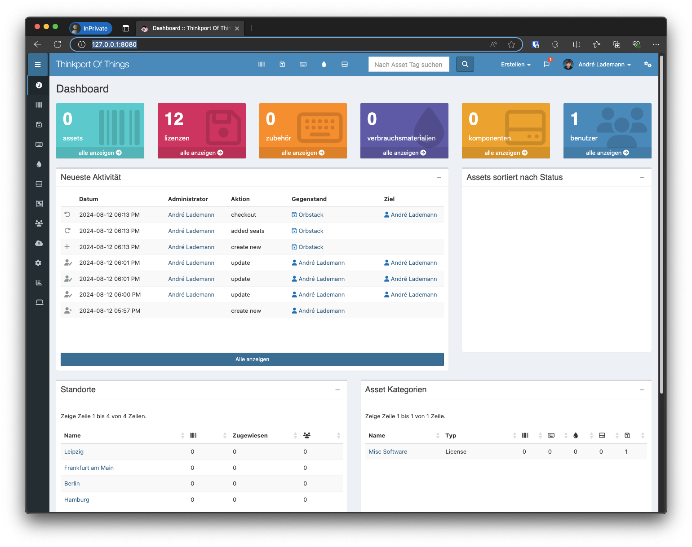
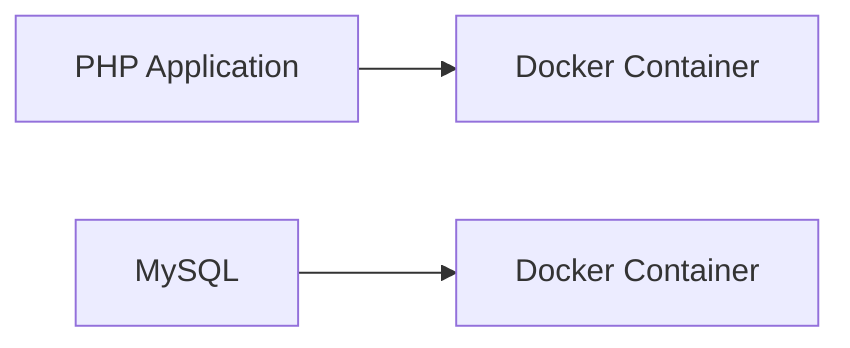

# SnipeIT

Snipe-IT is a free, open source IT asset management system written in PHP. With this docker-compose file, you can easily run Snipe-IT on your local machine.



## Architektur



Snipe-IT ist ein kostenloses, Open-Source-IT-Asset-Management-System, das in PHP geschrieben ist. Mit diesem Docker-Compose-File können Sie Snipe-IT einfach auf Ihrem lokalen Rechner ausführen.

## Usage

### Start the container

First, clone the repository and then run the following command:

```bash
docker compose up -d
```

- Open the browser and go to `http://localhost:8080`.
- To get access to the mailhog, go to `http://localhost:8025`.

### Restart the container

```bash
docker compose down && docker compose up -d
```

### Generate app key

```bash
docker compose run --rm app php artisan key:generate --show
```

---
