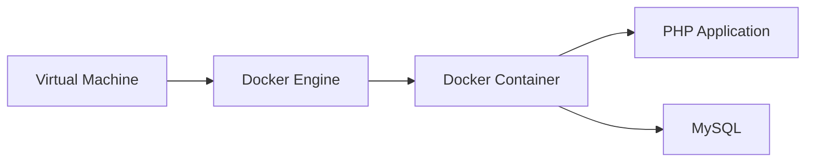

# Infrastruktur

Die Infrastruktur für die Anwendung besteht aus einem virtuellen Server, auf dem Docker installiert ist. In diesem Docker-Container laufen zwei Docker-Container, einer für die PHP-Anwendung und einer für die MySQL-Datenbank.

## Virtual Machine

Die Virtual Machine ist ein virtueller Server, auf dem Docker installiert ist. Die Virtual Machine wird von einem Cloud-Provider bereitgestellt und verfügt über eine statische IP-Adresse. Auf der Virtual Machine läuft der Docker Engine, der die Docker-Container verwaltet.

## Docker Engine

Die Docker Engine ist die Laufzeitumgebung für Docker-Container. Sie besteht aus dem Docker-Daemon, der die Docker-Container erstellt, startet, stoppt und löscht, und dem Docker-Client, der mit dem Docker-Daemon kommuniziert. Die Docker Engine läuft auf der Virtual Machine und ermöglicht die Ausführung von Docker-Containern.

## Docker Container

Ein Docker-Container ist eine Instanz eines Docker-Images, das eine ausführbare Anwendung enthält. In unserem Fall gibt es zwei Docker-Container: einen für die PHP-Anwendung und einen für die MySQL-Datenbank.

### PHP Application

Der Docker-Container für die PHP-Anwendung enthält die Snipe-IT-Anwendung, die in PHP geschrieben ist. Der Docker-Container verwendet das offizielle PHP-Image als Basisimage und installiert die notwendigen PHP-Erweiterungen. Die Anwendung wird im Docker-Container gestartet und über den Port 80 nach außen verfügbar gemacht.

### MySQL

Der Docker-Container für die MySQL-Datenbank enthält die MySQL-Datenbank, die von der Snipe-IT-Anwendung verwendet wird. Der Docker-Container verwendet das offizielle MySQL-Image als Basisimage und konfiguriert die Datenbank für die Verwendung mit der Snipe-IT-Anwendung. Die Datenbank wird im Docker-Container gestartet und über den Port 3306 nach außen verfügbar gemacht.

## Zusammenfassung

Die Infrastruktur für die Anwendung besteht aus einem virtuellen Server, auf dem Docker installiert ist. In diesem Docker-Container laufen zwei Docker-Container, einer für die PHP-Anwendung und einer für die MySQL-Datenbank. Die Virtual Machine wird von einem Cloud-Provider bereitgestellt und verfügt über eine statische IP-Adresse. Die Docker Engine verwaltet die Docker-Container und ermöglicht die Ausführung der Anwendung. Die PHP-Anwendung und die MySQL-Datenbank sind in separaten Docker-Containern isoliert voneinander und kommunizieren über das Netzwerk miteinander. Die Anwendung ist über den Webbrowser erreichbar und kann von den Mitarbeitern der Thinkport GmbH genutzt werden.
